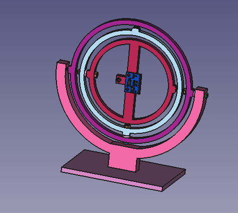
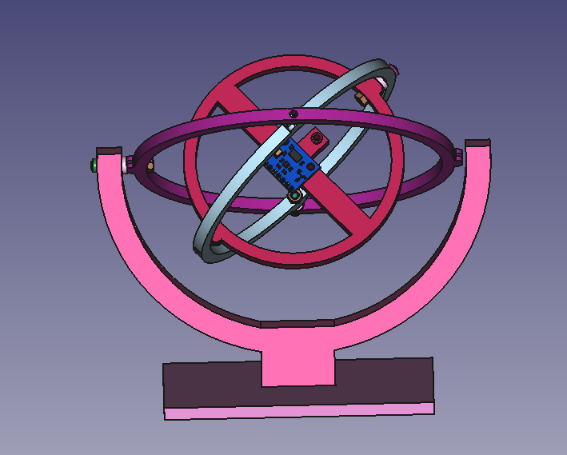
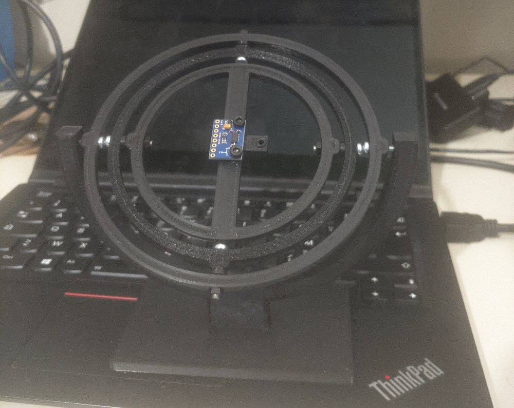
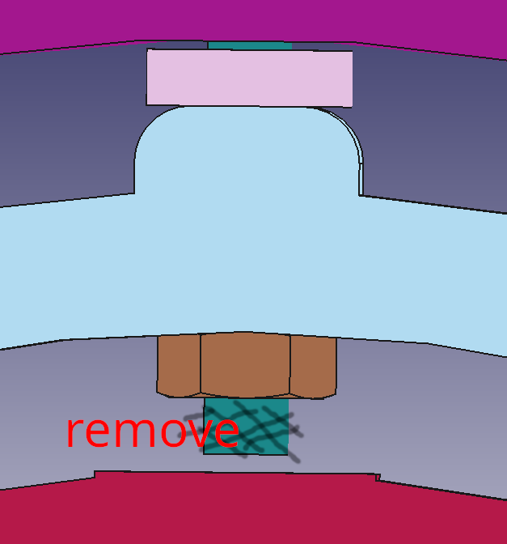

A jig to calibrate varios IMU sensors. I design it and build it for the LSM303DLHC

Please edit body first_circle, schetch sensor_base to change the mounting holes for other sensor.

# Hardware

- 2x M3x20mm - need to file off around 2mm
- 4x M3x25mm
- 6x M3 nut
- A hand file

Need to remove around 2mm of the M3x20mm screw

## License

Copyright (c) 2024 Kostas Gompakis

Licensed under the MIT license.
